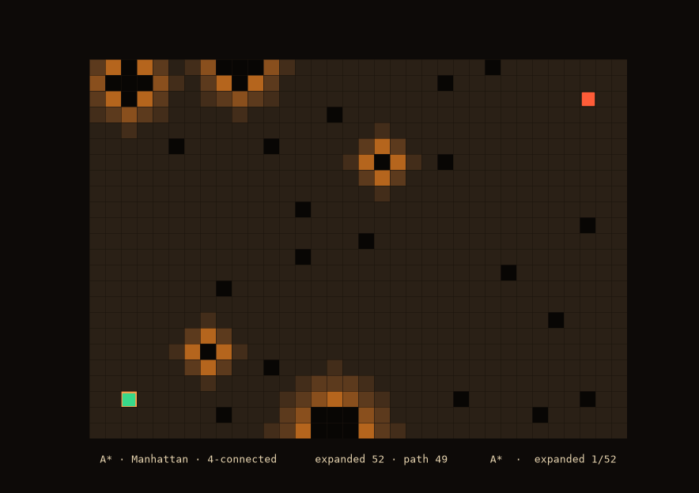
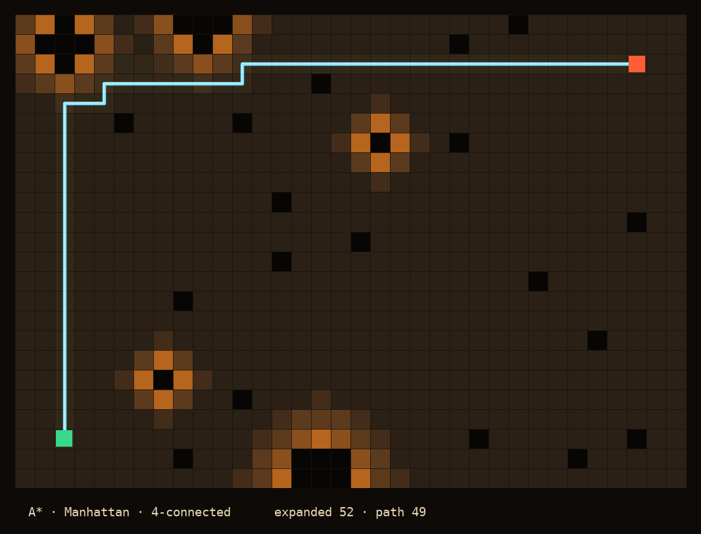

# From A* to Anthropic: Nearly 60 Years of Teaching Mars Rovers to Find Their Way

### Part 1 — A\*: the idea that still drives Mars

---

If you're like me, you're a little bit obsessed with the moment space exploration is living through right now. And a few months ago I came across a piece of news that stuck with me: for the first time, NASA had let an AI plan a rover's route on Mars.

I found it fascinating. It sat right at the intersection of the things I love: space, robotics, AI. And I thought it would make a great topic to dig into and write about. This series is what came out of that.

The details, in case you missed them: in early December 2025, on a couple of drives, the Perseverance rover followed a route that had been sketched with the help of an AI: Anthropic's Claude. It's worth being precise about what that did and didn't mean, because the headlines made it sound bigger than it was. Rovers have navigated autonomously between waypoints for years; that part wasn't new. What was new is who proposed the waypoints. Normally human rover drivers study images of the terrain and decide where the rover should aim. On these drives, an AI took a first pass at that: it read orbital imagery, flagged hazards, and suggested a chain of waypoints. Then the human process kicked in exactly as it always does: engineers reviewed the plan and ran it through a digital twin, a simulation modelling hundreds of thousands of variables of the rover's behaviour, before anything was sent to Mars. The rover's onboard navigation still handled the metre-by-metre driving.s.

But to really appreciate what it means for an AI to plan a path on Mars, you have to understand what "planning a path" has meant for the last half-century. And that story starts with an algorithm from 1968 that is, remarkably, still at the heart of how robots find their way today.

This is part one. We begin at the beginning: with A\*.

---

## Why driving on Mars is hard in a way that driving on Earth is not

Here is the problem that shapes everything about rover navigation.

Mars is, on average, about 225 million kilometres from Earth. Radio waves take between three and twenty-two minutes to make that trip one way, depending on where the two planets are in their orbits. That delay makes real-time driving completely impossible. By the time you saw a rock through the rover's eyes and told it to stop, it would already have driven into the rock several minutes ago.

So rovers cannot be driven. They have to be *sent plans*. A human team studies the terrain, sketches a route, sends it across the solar system, and then waits to find out what happened. For 28 years, across multiple missions, that planning has been done by hand by human "rover drivers." The stakes are real: in 2009, the Spirit rover drove into a hidden sand trap and never got out. It ended its mission there.

This constraint is exactly the kind of problem that *path planning algorithms* were invented to solve. The rover needs to find a route that is not just any route, but a good one: short, safe, and cheap in terms of the precious energy it spends. And it needs to be found by a computer following a precise procedure, not by intuition.

That procedure, in its earliest and most influential form, is A\*.

---

## Where does the "map" even come from?

Before we can talk about finding a path *through* a map, we have to answer a question that stopped me in my tracks the first time I read about this: **where does the map come from in the first place?** On Earth we have Google Maps. Mars has no such thing. So what is the rover actually planning *on*?

The answer is that the map is built from images. And it comes from two directions at once.

From **above**, orbiters photograph the surface. NASA's Mars Reconnaissance Orbiter carries a camera called HiRISE that can resolve features on the ground down to roughly 30 centimetres per pixel. Those images, combined with digital elevation models that encode the *slope* of the terrain, give planners a bird's-eye view of what's ahead: where the bedrock is, where the boulder fields lie, where the sand ripples ripple.

From the **ground**, the rover's own cameras photograph its immediate surroundings in stereo which lets onboard software reconstruct the 3D shape of the terrain nearby, judging what's a safe step and what's a wheel-swallowing trap.

Both of these get distilled into something a computer can plan on: a **grid**. The terrain is divided into cells, like a chessboard laid over the landscape, and each cell is tagged with a *cost* that says how hard or dangerous it is to drive across. Flat bedrock is cheap. A slope is more expensive. A boulder is effectively infinite: never go there.

This grid, with its per-cell costs, is called a **traversability grid** or a **cost map**, and it is the stage on which every algorithm in this series performs. It's worth pausing on the honesty of this abstraction: the real Martian surface is continuous, messy, and three-dimensional, and we are flattening it into a checkerboard of numbers. Almost everything clever in path planning comes from how well that checkerboard captures reality. We will spend the whole series pushing on that idea. For now, take the grid as given: a field of cells, each with a cost, a starting cell where the rover sits, and a goal cell we want it to reach.

The question A\* answers is deceptively simple to state: **what is the cheapest path across this grid from start to goal?**

---

## The ancestor: how do you search a map at all?

Imagine you're standing in the start cell and you want to reach the goal, and all you can do is step to a neighbouring cell at a time. The most thorough thing you could do is explore *outward in every direction at once*, like ripples spreading from a stone dropped in a pond. You visit the closest cells first, then the next closest, and so on, keeping track of the cheapest way you've found to reach each cell, until the expanding ripple finally washes over the goal.

That's essentially **Dijkstra's algorithm**, from 1959, and it works. It always finds the cheapest path. But it's wasteful: it explores in *every* direction with equal enthusiasm, including directly away from the goal. If your goal is to the east, Dijkstra still cheerfully explores far to the west, "just in case." On a small grid that's fine. On a large one, it's a lot of wasted effort. And wasted effort, for a computer on a spacecraft with a tight power and time budget, matters.

The obvious question is: could we *aim*? If we know roughly which direction the goal is in, could we bias the search to explore toward it first, and leave the wrong-way cells for later?

That is exactly the leap A\* makes.

---

## A\*: search that aims

A\* was published in 1968 by Peter Hart, Nils Nilsson, and Bertram Raphael at the Stanford Research Institute. Its insight is elegant, and once you see it you can't unsee it.

At every moment, A\* has a collection of cells it *could* explore next: the frontier. Dijkstra picks the frontier cell that was cheapest *to reach so far*. A\* picks the frontier cell that looks best by a smarter measure: the cost to reach it so far, **plus an estimate of the cost still remaining** to get from there to the goal.

Those two quantities have names that show up in every path-planning codebase in the world:

- **g** - the cost of the cheapest known path from the start to this cell. This is a fact; we've found this path, so we know it.
- **h** - sthe *heuristic*: an estimate, a guess, of the cost from this cell onward to the goal. We haven't travelled it yet, so we can only estimate.

A\* orders its frontier by their sum:

> **f = g + h**

It always expands the cell with the smallest **f**: the cell that sits on the most promising *complete* route, balancing "how much have I already spent to get here" against "how much do I think I have left to go."

The heuristic **h** is where the "aiming" happens. If the estimate points roughly toward the goal, the search leans that way and skips the pointless westward wandering. And here is the beautiful part, the part that makes A\* not just fast but *trustworthy*: as long as the heuristic never *overestimates* the true remaining cost (a property called being **admissible**) A\* is guaranteed to find the genuinely cheapest path. It's allowed to be optimistic, never pessimistic. Optimism makes it fast; the promise never to overestimate keeps it correct.

For a grid where you can only step north, south, east, or west, the natural admissible heuristic is the **Manhattan distance**: the number of horizontal steps plus the number of vertical steps to the goal, ignoring obstacles. Since it ignores obstacles, it can only ever *underestimate* the real cost (obstacles make things longer, never shorter), which is precisely the optimism A\* needs.

If you set the heuristic to zero A\* stops aiming and collapses back into Dijkstra, exploring blindly in all directions. That's a lovely way to feel that the heuristic gives you a sense of direction.

---

## Watching it think

This is the point where path planning stops being abstract, because A\* is wonderfully visual. Here is A\* solving a patch of Mars-like terrain — dark soil is cheap to cross, orange is increasingly rocky and costly, black cells are impassable rock. The rover starts at the green square and wants to reach the red one.

Watch the pale gold frontier. That's the leading edge of the search, the cells A\* is actively considering. See how it doesn't spread evenly in all directions like a raindrop ripple would. It *reaches* toward the goal, stretching and flowing around the rocky outcrops, feeling its way through the gaps. The dim trail left behind is every cell A\* examined and closed. When the frontier finally touches the goal, the algorithm reconstructs the cheapest path back to the start — the cyan line.

Here is the final result as a single image:

Two things are worth noticing in that final picture, because both will matter enormously later in this series.

First, look at how much of the grid A\* *didn't* bother exploring: The large dark regions it never touched. That's the heuristic earning its keep, steering the search away from hopeless directions. On this small grid it saved a few hundred cell visits. Scale that to the kilometre-wide maps a real rover plans across, and the savings become the difference between a plan that computes in seconds and one that doesn't finish in time.

Second, look at the *shape* of the path. See how it moves only in right angles, stair-stepping its way across the terrain? That's not an accident or a rendering choice. It's a direct consequence of a decision we made about the grid: we allowed the rover to step only north, south, east, and west, never diagonally. The path can only be built from the moves we permitted, so it comes out blocky. It works, it's the cheapest path *given those rules*. But no rover on Mars actually drives in perfect right-angle staircases. That gap between the blocky grid path and the smooth line a real rover wants to follow is the crack that the next generations of algorithms were invented to fill. We'll pry it wide open in part three.

---

## A little bit of engineering: the pieces you actually build

If you were to implement this yourself (the code for this series is linked at the end) A\* turns out to need surprisingly few moving parts, and they're worth naming because they recur in every algorithm to come.

You need a **map** that, given a cell, can tell you its traversable neighbours and the cost of stepping to each. Whether that map is a grid laid over Martian terrain or an abstract graph of connected nodes doesn't matter to A\* at all. It only ever asks "what are this cell's neighbours, and what does each step cost?" That clean separation is what lets the same planner drive a warehouse robot and a Mars rover.

You need a **heuristic**: the function that estimates remaining cost and does the aiming. Swap it out and you change the algorithm's whole personality, Manhattan distance for a four-direction grid, zero to fall back to blind Dijkstra.

And you need one genuinely clever data structure: a **priority queue** that always hands you the frontier cell with the smallest **f**, and lets you *update* a cell's priority when you discover a cheaper route to it mid-search.

That's the whole skeleton: a map that knows its neighbours, a heuristic that aims, and a priority queue that keeps the search honest about what to look at next.

---

## Where A* falls short

A* has a quiet assumption baked into it: that the map doesn't change. It plans across a grid it knows completely, from start to goal, in one shot. But a rover crossing an alien landscape is constantly finding out the map was wrong: a rock it couldn't see from orbit, a patch of sand softer than it looked. Replanning from scratch every time it learns something new would be too slow. The algorithms that came after A* - D*, D* Lite, Field D* - are largely about teaching A*'s core idea to cope with a map that keeps changing underfoot. That's part two.

And the drives from the opening fit here too. Choosing where the waypoints go, reading raw imagery with all the visual detail a cost-grid throws away, is the part the AI took a pass at. Everything downstream, turning those waypoints into safe motion across shifting terrain, is still the job of planners descended from the algorithms in this series. JPL's Vandi Verma describes off-world driving as three pillars: perception (seeing the rocks and ripples), localization (knowing where you are), and planning and control (deciding and executing the path). The AI reached into the first. This series is about the third.

So that's where we start: with A*, the ancestor. Next, we teach it to handle a world that won't hold still.

---

*Part 2 will cover D\* and D\* Lite: how to replan efficiently when the map changes as you drive. The full implementation — modern C++, tested, with the visualizer that produced the images above — is on GitHub \[link].*

*The images in this article were generated from a real A\* search on procedurally generated Mars-like terrain, using the open-source visualizer built for this series.*