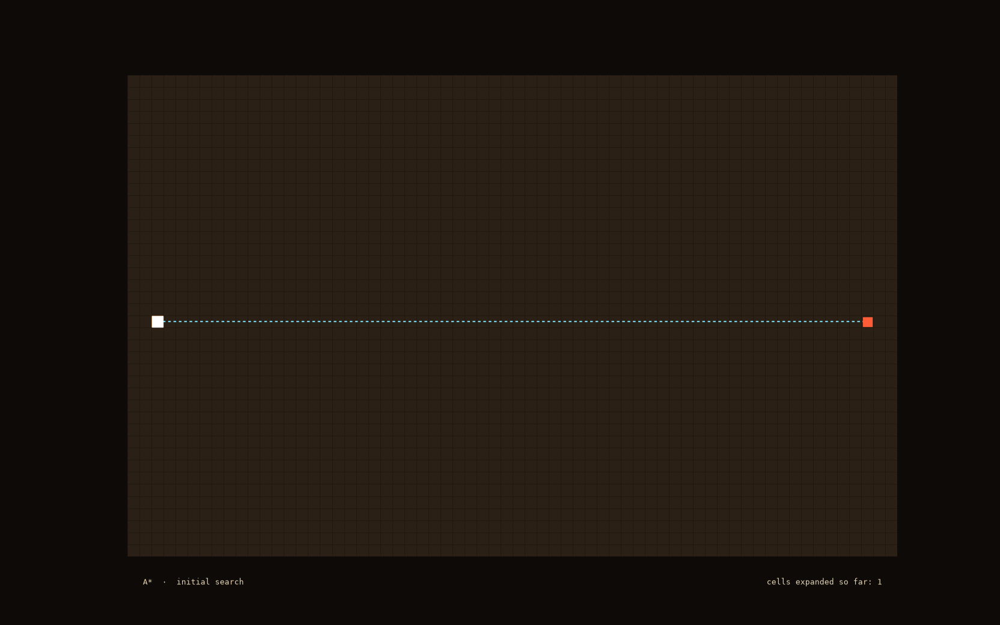
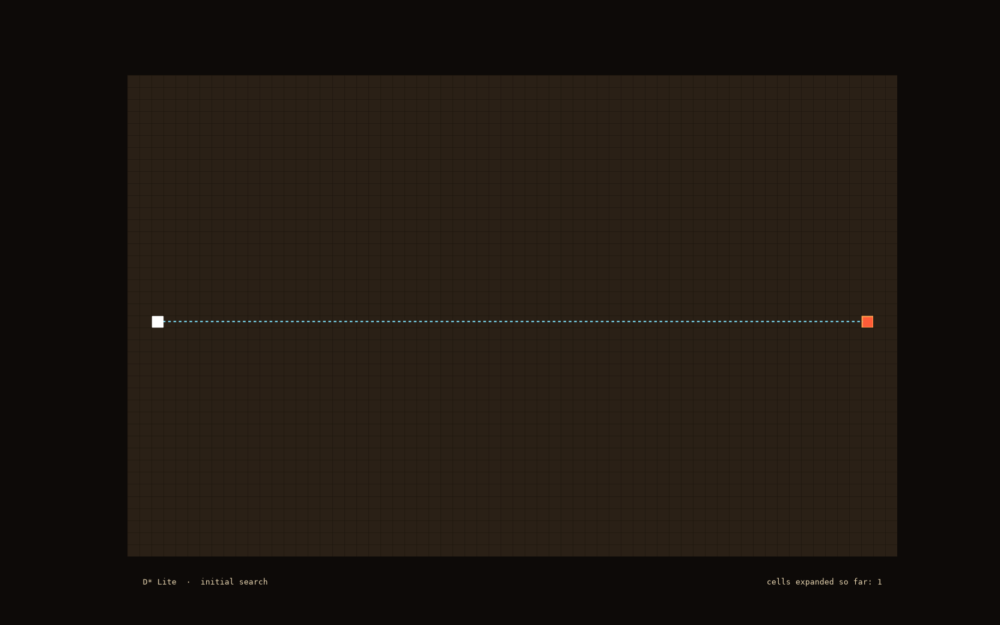
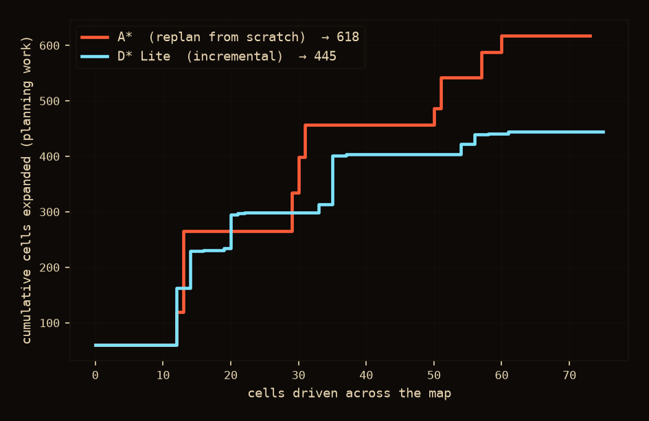
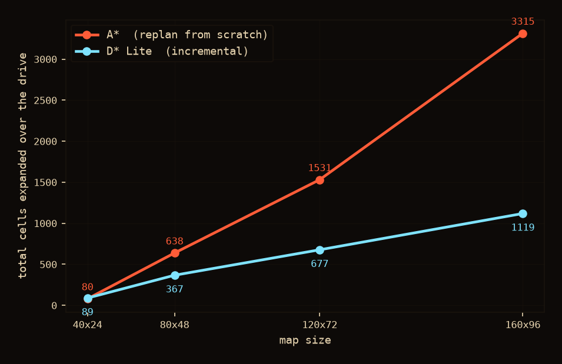
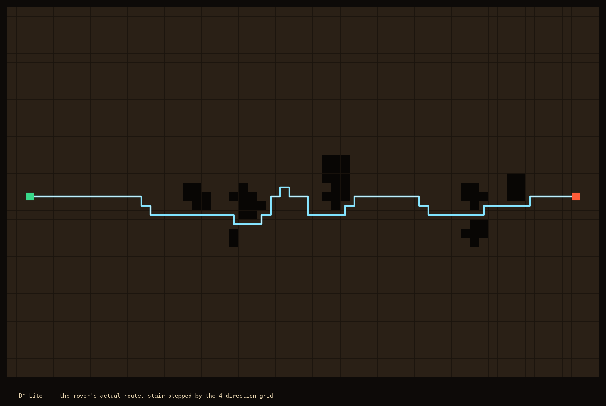

<!--
  WORKING SKELETON for Part 2. Section headers + intent notes + visualization
  placeholders. We fill the prose in together. Author notes are in > _italic_
  callouts and HTML comments; delete them as each section gets written.

  Decisions locked so far:
   - HONEST FRAMING (from measuring the real code): D* Lite is NOT always fewer
     expansions than A*. A single big new obstacle is its worst case (raise-heavy).
     Its win is REUSE that compounds with map size + number of replans. So the
     realistic Mars scenario -- a rover with a short sensor horizon discovering
     obstacles as it drives -- is where it shines.
   - Visuals: two drive GIFs (astar_drive.gif, dlite_drive.gif) + a scaling chart
     (replan_scaling.png) that carries the quantitative punch. Plus the blocky
     route hero (dlite_hero.png) -> Field D*.
   - Obstacles are true impassable rock; both planners use the SAME informed
     heuristic (A* -> distance-to-goal, D* Lite -> distance-to-robot).
   - Note for writing: D* Lite's search is goal-anchored, so its per-replan
     footprint STREAKS along the corridor (fewer cells than A*, but stretched);
     the honest metric is the running expansion count, not the cloud's area.
-->

# From A* to Anthropic: Nearly 60 Years of Teaching Mars Rovers to Find Their Way

### Part 2 — D\* and D\* Lite: replanning when the map won't hold still

---

<!-- INTRO -->
> _Intent: pick up Part 1's exact closing thread ("teach it to handle a world
> that won't hold still"). One or two short paragraphs. A rover crossing an alien
> landscape is constantly discovering the map was wrong — a rock unseen from
> orbit, sand softer than it looked. Set up the question: what do you do when the
> world changes after you've already planned?_

---

## When the map lies
<!-- SECTION 1 — the problem, motivate dynamic replanning -->
> _Intent: A\* planned a clean path across the cost map. The rover drives, and its
> sensors keep discovering rocks that weren't on the map. Every time one blocks the
> route, A\*'s only move is to throw everything away and search again from where it
> stands. Watch the search cloud re-ignite at every discovery — the counter keeps
> climbing. Land the question: surely we can reuse what we already computed?_

<!-- Viz 1: A* sensor-limited drive. The counter (ends ~618) is the honest metric. -->

---

## The slowest computer you'll respect
<!-- SECTION 2 — hardware; this is the STAKES, not a tangent -->
> _Intent: rover CPUs are slower than a decade-old phone (RAD750, ~200 MHz,
> PowerPC). Explain WHY, honestly: space radiation causes single-event upsets; a
> single ionizing particle can flip a bit. Smaller transistors hold less charge
> per stored bit (lower critical charge), so they flip more easily — which is why
> rad-hardened chips deliberately use older, larger, slower process nodes. Trade
> raw speed for not-corrupting-your-state-mid-drive._
>
> _HINGE SENTENCE (end the section here): on a computer like that, you cannot
> afford to recompute the whole plan every time the world twitches. You must reuse
> the work you already did. That single constraint is what the rest of this
> article is about._

---

## D\*: the first to reuse — and why it's hard
<!-- SECTION 3 — original D* (Stentz 1994), BRIEF -->
> _Intent: keep it short. D\* (Stentz, 1994) was the first to make A\*'s idea
> incremental: when an edge cost changes, don't restart — propagate the change
> outward through the affected nodes. Introduce the notion of an INCONSISTENT node
> ("something changed here; this node and its neighbours may need to be
> reconsidered"). Original D\* tracks RAISE and LOWER states as costs rise and fall,
> and the bookkeeping is famously hard to reason about and to prove correct. That
> difficulty is the reason a cleaner reformulation came along. The full
> implementation is linked — this stays high-level._

---

## D\* Lite: the same idea, made sane
<!-- SECTION 4 — D* Lite (Koenig & Likhachev 2002), high-level; the payoff viz -->
> _Intent: high-level, three beats._
>
> _1. THE AHA — search BACKWARD from the goal. The goal never moves; the robot
> does. Anchor the search at the goal, and when the rover advances or finds a rock,
> most cost-to-goal values are still valid — only a local patch needs repair._
>
> _2. THE BOOKKEEPING, gently — every cell keeps two numbers: g (last-known
> cost-to-goal) and rhs (a one-step lookahead: the best its neighbours currently
> offer). When they disagree, the cell is inconsistent and goes back on the queue.
> Repair spreads only as far as the disagreement reaches._
>
> _3. THE PAYOFF — after a change, D\* Lite re-expands only the affected region, not
> the whole map. Code linked for anyone who wants the exact mechanics (g/rhs, the
> two-part key, the km trick that lets the start move)._

<!-- Viz 2: D* Lite drive, same terrain/obstacles as Viz 1. Counter ends ~445 vs
     A*'s ~618. Note: D* Lite replans MORE often but expands FEWER cells total. -->

<!-- Viz 2b: the two counters on one axis (A* 618 vs D* Lite 445). Makes the count
     contrast unmissable without relying on the search-cloud shapes. -->

> _Intent: the payoff, quantified honestly. D* Lite's edge isn't dramatic on a
> small map — but it compounds: the bigger the map, the more A* pays to re-search
> from scratch every time, while D* Lite's reuse keeps its cost low. On real
> kilometre-wide rover maps the gap is enormous. THIS is why it matters for Mars._

<!-- Viz 3: scaling chart. The quantitative core of the article. -->

---

## Still going the long way round
<!-- SECTION 5 — limitation + teaser for Part 3 -->
> _Intent: even with efficient replanning, the path is still built from
> north/south/east/west steps — blocky right-angle staircases, driving more
> distance than a real rover needs. Same crack Part 1 pointed at. That gap is what
> the next algorithm closes: Field D\*, the any-angle planner that actually flew on
> Mars._

<!-- Viz 3: final path still, echoing Part 1's hero, to motivate any-angle planning. -->

---

<!-- CLOSING — mirror Part 1's italic teaser + GitHub link format -->
> _Part 3 will cover Field D\*: any-angle paths, and the version that actually drove
> on Mars. The full implementation — modern C++, tested, with the visualizer that
> produced the images above — is on [GitHub](https://github.com/higim/space-path-planning/tree/main)._
>
> _The images in this article were generated from real D\* Lite searches on
> procedurally generated Mars-like terrain, using the visualizer built for this series._
