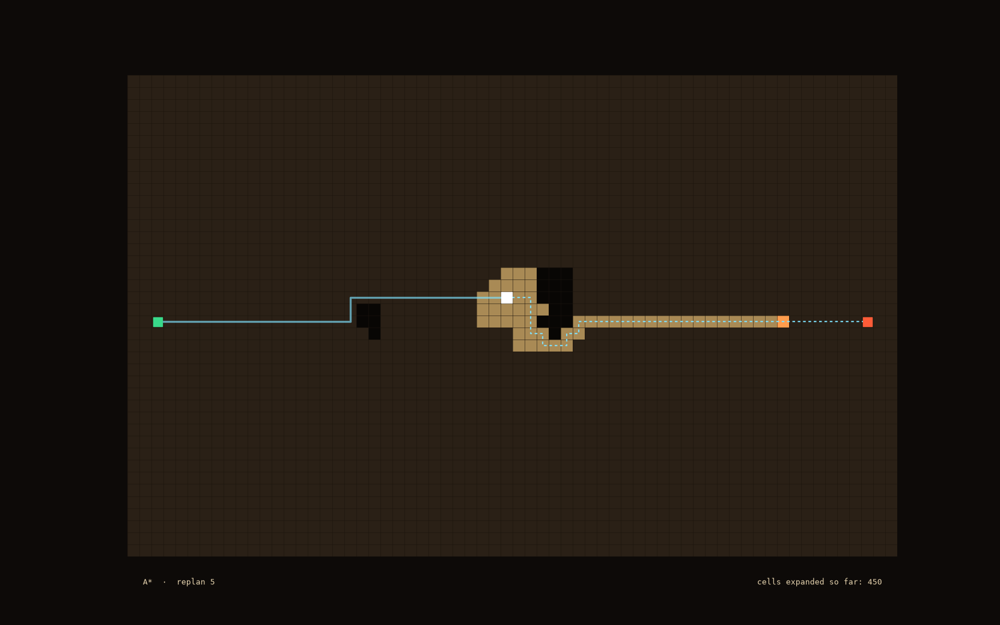

# From A* to Anthropic: Nearly 60 Years of Teaching Mars Rovers to Find Their Way

### Part 2. D\* and D\* Lite: replanning when the map won't hold still

---

In part one we met A\*, the algorithm still at the core of how robots plan routes, and watched it sweep across a patch of Mars-like terrain to pick out the cheapest path from start to goal. But there's an assumption built into A* that I flagged at the end: it believes the map. It plans across a grid it knows completely, in one shot, and then it's finished.

A rover crossing Mars doesn't get to work that way. Its map is stitched together from orbital photographs, and it's always a little wrong somewhere. A rock the orbiter couldn't resolve. A patch of sand that looked firm and isn't. A slope that turns out steeper up close than it seemed from 300 km up. The rover finds these things out the only way anyone finds out anything on Mars: by driving into the neighbourhood and looking. And each time it learns something new, the path A\* handed it back at the start may no longer hold.

That's the question now: what do you do when the world changes after you've committed to a plan? The obvious first answer is to run the algorithm again, with your current position as the new start. But that costs more than you'd expect, for reasons that have as much to do with the rover's hardware as with the algorithm itself.

## When the map lies

Picture the rover mid-drive. A\* gave it a clean route to the goal, and it's been rolling along it, ticking off cells one by one. Then the cameras catch something the map didn't have: a boulder, squarely in the path ahead.

From that point on, the plan is worthless. The rover has to find another way around, and A\* has exactly one move available: forget everything and search again from where it's standing. It keeps no memory of the work it just did. The frontier it grew so carefully, the hundreds of cells it examined and closed, all of it gets thrown out, and a fresh search inflates from scratch.

You can see it in the animation. Every time a rock blocks the route, the search cloud re-ignites around it: a new cone of exploration, from nothing, mostly just to rediscover the path the rover already had.

It gets the rover there, but it repeats an enormous amount of thinking to do it. Each obstacle triggers a full search, and most of what that search turns up is identical to what the rover knew a second earlier. The terrain didn't change, only one small corner of it did.

So the obvious question is whether we can reuse what we already computed instead of rebuilding the plan from scratch. The answer is yes, and it's the whole point of this article. But first it's worth seeing why the waste hurts so much on Mars specifically, and for that you have to meet the rover's brain.

## A brain from the 1990s

The computer flying Perseverance runs on a chip called the RAD750, clocked at 200 MHz. That rover landed in 2021. It shoots and caches samples for a future return mission, and it carried a helicopter to another planet, all on a processor about as fast as a desktop PC from the late 1990s. It's the same PowerPC 750 Apple put in the 1998 iMac, hardened for space. A modern phone runs circles around it.

That's a deliberate choice, and the reason is radiation.

Out beyond Earth's magnetic field, and on the surface of a Mars that has none of its own, space is full of high-energy particles: cosmic rays from distant supernovae, protons streaming off the Sun. When one of them strikes a microchip it dumps a small packet of charge into the silicon, and in a modern processor that can be enough to flip a bit, turning a 0 into a 1 in the middle of a calculation. It's called a single-event upset. One stray particle, one corrupted number, and the arithmetic steering a two-billion-dollar rover across a crater floor is quietly wrong.

Why are modern chips so vulnerable to this and old ones less so? It comes down to size. As transistors have shrunk, the relentless march that makes each phone faster than the last, each one holds less charge to represent a stored bit. The energy needed to flip that bit keeps dropping, until a cutting-edge transistor stores so few electrons that a single cosmic ray can overwhelm it. An older, larger transistor sits at a higher voltage and shrugs the same particle off. Radiation-hardened chips are built the opposite way to consumer chips on purpose: bigger transistors, older manufacturing, generous margins. They give up raw speed for the more valuable property of not corrupting themselves mid-thought.

Speed isn't the only thing in short supply. Perseverance has no solar panels; it runs off a lump of decaying plutonium that puts out about 110 watts, roughly a household light bulb. Two batteries store that trickle up and hand it back in bursts, because a single science activity can draw 900 watts on its own. Every watt the processor spends thinking is a watt not going to the drill, the heaters that keep the electronics alive through a −80 °C night, or the drive motors. And the working day is short: the rover has a limited window of daylight and warmth to get anything done before it has to hunker down again.

So on a computer this slow, with a power budget this tight and a day this short, you can't throw the plan away and rebuild it from nothing every time a rock surprises you. You repair the plan instead of recomputing it, and that constraint is what the rest of this article is about.

---

## D*: the first to reuse, and why it's hard

The first algorithm to take reuse seriously was D\*, published by Anthony Stentz at Carnegie Mellon in 1994. The name stands for "Dynamic A\*," and the dynamism is the point: when the map changes, D\* doesn't restart. It takes the search it already has and repairs it, pushing the consequences of the change outward only as far as they actually reach.

The idea it introduced, and the one that runs through everything that came after, is the inconsistent node. When an edge cost changes, say a cell that used to be cheap is now a rock, the nodes that depended on it are suddenly out of date: the cost they think it takes to reach the goal no longer matches reality. D\* puts those nodes back on its queue and works through them, fixing each one and waking its neighbours if they're affected too. The correction ripples outward until everything agrees again, and in practice it stops long before it has touched the whole map.

That last part is what makes it work. The bookkeeping is what makes it hard. D\* tracks whether each node's cost is going up or down, states it calls RAISE and LOWER, and the rules for propagating a raised cost differ from the rules for a lowered one in ways that are genuinely fiddly. I've implemented it, and I'll say plainly that D\* is hard to reason about. Tracing why a given node gets re-expanded, and convincing yourself the whole thing stays correct, tends to mean keeping the original paper open in another tab the whole time.

So D\* worked, and it flew, but it was thorny enough that people went looking for a cleaner way to express the same idea. They found one eight years later.

---

## D\* Lite: the same idea, made manageable

D\* Lite, from Sven Koenig and Maxim Likhachev in 2002, reaches the same place as D\*, reuse the search, repair only what changed, but by a route that's much easier to hold in your head. It's the version worth actually understanding, so here's the intuition; the exact mechanics are in the code.

The first idea is the one that makes the rest click, and it's a nice inversion: search backward, from the goal.

Here's why that helps. The goal doesn't move; it's a fixed spot on the map. The thing that moves is the rover. So if you anchor the search at the goal and compute, for every cell, the cost to get from that cell to the goal, most of those numbers stay true wherever the rover goes. When it advances a few metres, or spots a rock off to one side, the cost-to-goal for the vast majority of the map is unchanged. Only a small patch near the disturbance needs fixing. Anchor the search at the thing that stays put, and you keep almost all of your work almost all of the time.

The second idea is how D\* Lite knows which cells need fixing. Every cell carries two numbers. The first, g, is its last-known cost to the goal: what it currently believes. The second, rhs, is a one-step lookahead: the best its neighbours are offering right now. When the two match, the cell is settled and gets left alone. When they don't, when a cell's stored belief no longer matches what its neighbours actually offer, the cell is inconsistent and goes on the queue. That's the whole trigger. A new rock makes a few nearby cells disagree with themselves; D\* Lite fixes those, which may make their neighbours disagree, and the repair spreads outward exactly as far as the disagreement goes and no further.

Run the same drive as before and the rover barely reacts to most rocks: a small local repair, and it's moving again, reusing the search it built at the start instead of rebuilding it.

The payoff depends on scale. On a small map the lead is modest, and for a single very large change D\* Lite can even do more work than a fresh search, since raising a lot of costs at once is the thing it handles worst. But every time A\* replans from scratch it pays for the whole remaining search, while D\* Lite only ever pays for the patch that changed. The bigger the map, the wider that gap.

On these toy grids the gap is a factor of a few. On the real thing, a traversability map covering a kilometre of Martian ground, replanned over and over across a day's drive, that gap decides whether the next plan is ready in time or the rover sits waiting for it. Computation is the resource in short supply, and D* Lite spends it only where the terrain actually turned out to be different from the map. That's why a 2002 algorithm still earns its place on a chip built to 1990s tolerances.

---

## Still going the long way round

D\* Lite fixes the problem we started with. The rover can now drive into terrain it's never seen, find out it was wrong about it, and adapt without grinding its slow brain to a halt. That's a real and useful thing to be able to do.

But look at the route it produces.

It stair-steps. Every move is a right angle, north, south, east, west, because we're planning on a 4-connected grid: from any cell the rover may only step to the four it shares an edge with. You could let it take the four diagonal neighbours too, and we will in part three, but that only swaps right angles for 45° zig-zags; it still isn't the straight line the rover actually wants. It's the same blockiness we saw with A\* in part one, and it's still costing us. A real rover doesn't want to shuffle along in square steps; it wants to cut across open ground at whatever angle gets it there soonest. Every staircase corner is distance it didn't need to travel, and distance is time and battery it doesn't have to spare.

We've taught the rover to replan efficiently. We haven't taught it to drive in a straight line. Closing the gap between the blocky grid path and the smooth route a rover actually wants is what the next generation of algorithms was built for, and it's the one that actually flew to Mars.

Part 3 covers Field D\*: any-angle path planning, and the branch of this family that genuinely drove on the surface. The full implementation, modern tested C++ with the visualizer behind every image here, is on GitHub.

---

*Part 3 will cover **Field D\***: any-angle path planning, and the version of this family that genuinely drove on Mars. The full implementation is on [GitHub](https://github.com/higim/space-path-planning/tree/main).*

*The animations in this article were generated from real A\* and D\* Lite searches on procedurally generated Mars-like terrain, using the visualizer built for this series.
